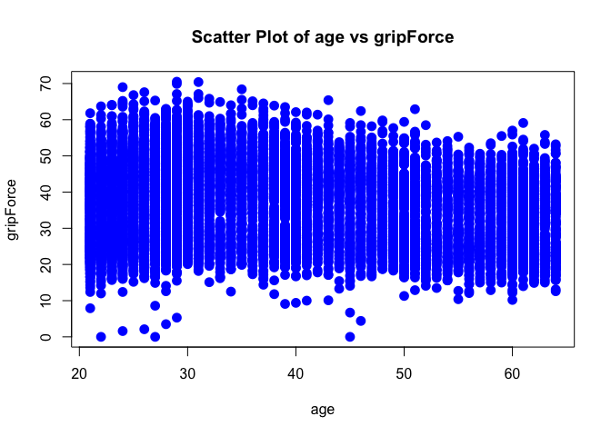
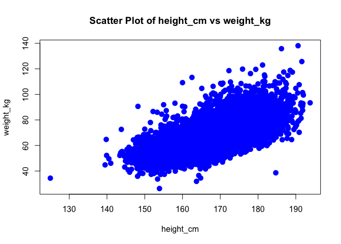

<!-- README.md is generated from README.Rmd. Please edit that file -->

# SamsBeautifulPackage

The goal of SamsBeautifulPackage is to offer R users several ready-made
functions for data cleaning and wrangling. Previously a user had to use
several lines of code which our package can now accomplish with one
simple function. We hope that you find this useful!

## Installation

To install the development version from [GitHub](https://github.com/)
use:

``` r
# install.packages("remotes")
remotes::install_github("jonasdfreeman/SamsBeautifulPackage")
```

## General Usage

For examples of how to use the functions in this package, the user
should direct their attention to the `Functions In SamsBeautifulPackage`
vignette. This vignette offers the user a series of examples of how to
apply the functions in the package to a dummy dataset which contains
several common issues in real-world data.

## User Guide for Mouse Data

This package was primarily designed to deal with the `mousedata.xlsx`
file which was presented in Statistics 108: Introduction to R (taught by
James Xenakis). We have included a helpful vignette entitled
`Using SamsBeautifulPackage On Mouse Data` which goes through a step by
step process outlining how our functions can be used to analyze mouse
data.

## Key Highlights:

1.  **`check_duplicates(df)`**: Checks for and displays duplicate rows.
2.  **`check_values(data, column_name, value1, value2)`**: Verifies if a
    column has only specific valid values.
3.  **`find_non_numeric(data, column_name)`**: Coerces a column to
    numeric data. Identifies and removes rows with non-numeric values in
    a column.
4.  **`generate_plot(data, x_var, y_var)`**: Generates scatter plots of
    two variables.
5.  **`percent_diff(df, col1, col2)`**: Identifies greater than 20%
    differences between two columns.
6.  **`remove_zeroes(data, column_name)`**: Removes rows where a column
    has zero, empty, or NA values.
7.  **`data_summary(data)`**: Gives the user a snapshot with some
    summary statistics of the numeric data.

### Contents

SamsBeautifulPackage contains one dataset called `ourdata`:

``` r
library(SamsBeautifulPackage)
data(package = 'SamsBeautifulPackage')
```

This dataset is originally sourced from Kaggle under the CC0 1.0
Universal licence. This is data that confirmed the grade of performance
with age and some exercise performance data.

Here is a link to the original dataset source:
<https://www.kaggle.com/datasets/kukuroo3/body-performance-data>

``` r
head(ourdata)
```

    ##   age gender height_cm weight_kg body.fat_. diastolic systolic gripForce
    ## 1  27      M     172.3     75.24       21.3        80      130      54.9
    ## 2  25      M     165.0     55.80       15.7        77      126      36.4
    ## 3  31      M     179.6     78.00       20.1        92      152      44.8
    ## 4  32      M     174.5     71.10       18.4        76      147      41.4
    ## 5  28      M     173.8     67.70       17.1        70      127      43.5
    ## 6  36      F     165.4     55.40       22.0        64      119      23.8
    ##   sit.and.bend.forward_cm sit.ups.counts broad.jump_cm class
    ## 1                    18.4             60           217     C
    ## 2                    16.3             53           229     A
    ## 3                    12.0             49           181     C
    ## 4                    15.2             53           219     B
    ## 5                    27.1             45           217     B
    ## 6                    21.0             27           153     B

The dataset was comrpised of 13393 rows and 12 columns, but the data in
the package has been wrangled to just 13392 rows (see data-raw folder).

``` r
str(ourdata)
```

    ## 'data.frame':    13392 obs. of  12 variables:
    ##  $ age                    : num  27 25 31 32 28 36 42 33 54 28 ...
    ##  $ gender                 : chr  "M" "M" "M" "M" ...
    ##  $ height_cm              : num  172 165 180 174 174 ...
    ##  $ weight_kg              : num  75.2 55.8 78 71.1 67.7 ...
    ##  $ body.fat_.             : num  21.3 15.7 20.1 18.4 17.1 22 32.2 36.9 27.6 14.4 ...
    ##  $ diastolic              : num  80 77 92 76 70 64 72 84 85 81 ...
    ##  $ systolic               : num  130 126 152 147 127 119 135 137 165 156 ...
    ##  $ gripForce              : num  54.9 36.4 44.8 41.4 43.5 23.8 22.7 45.9 40.4 57.9 ...
    ##  $ sit.and.bend.forward_cm: num  18.4 16.3 12 15.2 27.1 21 0.8 12.3 18.6 12.1 ...
    ##  $ sit.ups.counts         : num  60 53 49 53 45 27 18 42 34 55 ...
    ##  $ broad.jump_cm          : num  217 229 181 219 217 153 146 234 148 213 ...
    ##  $ class                  : chr  "C" "A" "C" "B" ...

### Function Examples

For more information on the specific functionality of the functions in
SamsBeautifulPackage, please see our documentation by typing
`help(package = "SamsBeautifulPackage")`.

Here are some fun examples of how our package can be used:

``` r
# Generate a plot automatically by inputting arguments into the generate_plot() function
generate_plot(ourdata, "age", "gripForce")
```

<!-- -->

``` r
# Check whether everyone's gender is either "M" or "F"
check_values(ourdata, "gender", "M", "F")
```

    ## [1] "All values in the column gender are either M or F"

``` r
# Here is a cool plot which plots heigh vs weight in one simple function
generate_plot(ourdata, "height_cm", "weight_kg")
```

<!-- -->

## Citation

To cite SamsBeautifulPackage package, please use:

``` r
citation("SamsBeautifulPackage")
```

    ## Warning in citation("SamsBeautifulPackage"): could not determine year for
    ## 'SamsBeautifulPackage' from package DESCRIPTION file

    ## To cite package 'SamsBeautifulPackage' in publications use:
    ## 
    ##   Freeman J, Sahibousidq A (????). _SamsBeautifulPackage: A
    ##   Comprehensive Toolset for Data Analysis and Visualization_. R package
    ##   version 0.0.0.9000.
    ## 
    ## A BibTeX entry for LaTeX users is
    ## 
    ##   @Manual{,
    ##     title = {SamsBeautifulPackage: A Comprehensive Toolset for Data Analysis and Visualization},
    ##     author = {Jonas Freeman and Abdu Sahibousidq},
    ##     note = {R package version 0.0.0.9000},
    ##   }

## License

Data are available by
[CC-0](https://creativecommons.org/share-your-work/public-domain/cc0/)

## Additional data use information

Anyone interested in publishing the data should contact Sam Lindemann
<samlindemann@college.harvard.edu>
